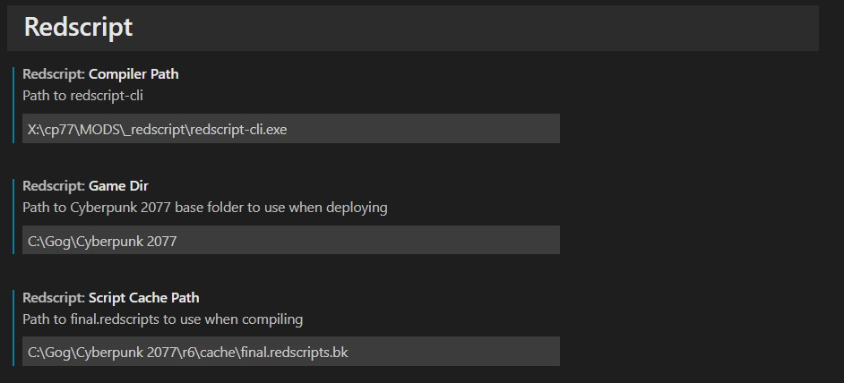
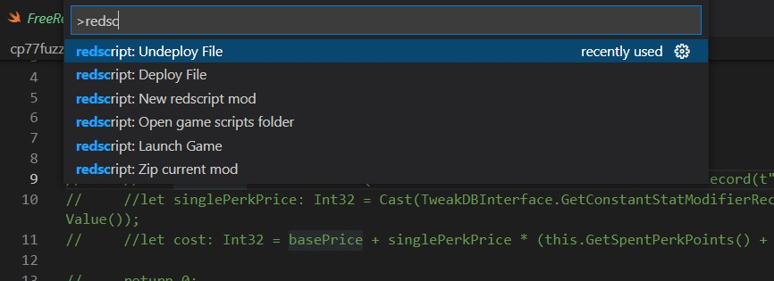

# redscript-vscode
VS Code extension for [redscript](https://github.com/jac3km4/redscript). It provides basic error hints for compiler errors in your source code.


## usage
This extension requires two settings in user preferences:
```json
"redscript.compilerPath": "D:\\win\\bin\\redscript-cli.exe",
"redscript.gameDir": "D:\\path\\to\\base\\game\\Cyberpunk 2077"
```
`compilerPath` should point to a compiler CLI executable.
`gameDir` should point to the base game folder (called Cyberpunk 2077).

A third setting is optional:
```json
"redscript.scriptCachePath": "D:\\path\\to\\r6\\cache\\final.redscripts.bk"
```
`scriptCachePath` may point to an existing redscripts bundle, and will default to `$gameDir/r6/chache/final.redscripts.bk`

You also need to configure VS Code to use `Swift` language mode when dealing with `reds` files. Language mode can be configured in the bottom-right corner of VS Code window (when a `reds` file is open).



## commands
This extension comes with commands that make development easier. Commands start with `redscript:` and can be exectuded from the [command palette](https://code.visualstudio.com/docs/getstarted/userinterface#_command-palette) (default: `Ctrl+Shift+P`). 

It is highly recommended to work inside a [workspace](https://code.visualstudio.com/docs/editor/workspaces) to fully make use of the commands. 
It is recommended to create new redscript files with in a `src` folder (the `Deploy mod` command copies all content inside the `src` folder to the game's `r6/scripts` folder):
```
ModName
├── src
│   ├── file1.reds
│   ├── file2.reds
│   ├── someFolder
│   │   ├── file3.reds
│   │   ├── file4.reds
```


### command list

- **Deploy Mod**: Copies all files from the `src` folder parent of the current open file to `r6/scripts` (if no `src` folder exists, copies the current file)
- **Undeploy Mod**: Deletes all files from the `src` folder parent of the current open file from `r6/scripts` (if no `src` folder exists, deletes the file with the same name as the current file)
- **Open game scripts folder**: Opens the `r6/scripts` folder in Explorer
- **Launch Game**: launches the game
- **Zip current mod**: creates a zip of the `src` folder parent of the current open file and creates the correct `r6/scripts` structure inside the zip file 
- **New redscript mod**: creates a new folder in the current workspace called `myMod` and creates a new empty redscript file at `myMod/src/main.reds` 


